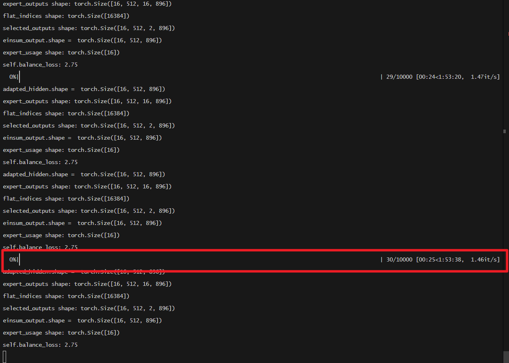
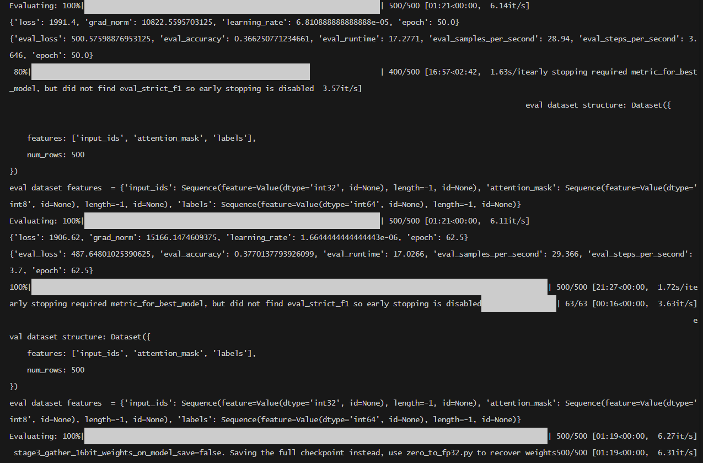
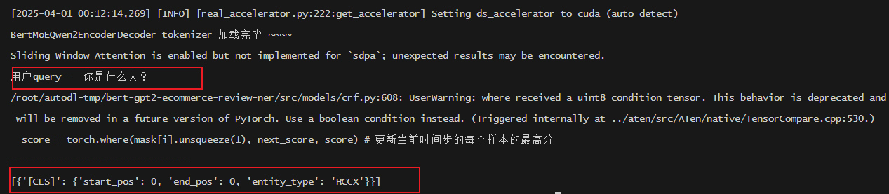
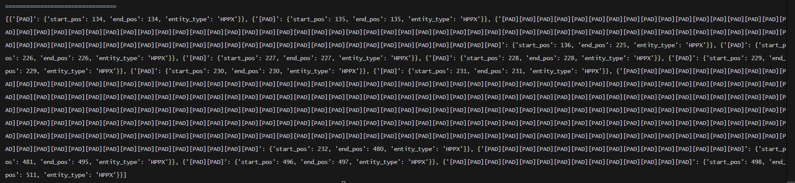

# bert-qwen2-ecommerce-review-ner
基于 Bert + MoE + Qwen2 + CRF 改造和LoRA微调的电商评论NER模型


## Project Description
- 将Bert (Encoder) 和 MoE 和 Qwen2 (Decoder) 拼接起来，最后加上一个CRF层，来完整最终的电商评论NER任务。
- 我们将这个拼接起来的模型称之为 `Bert-MoE-Qwen2-CRF`
- 然后，再使用LoRA对`Bert-MoE-Qwen2-CRF`模型在NER任务上进行微调。

- CRF模型默认使用 维特比解码


## 模型架构设计

### 整体架构
项目将Bert, MoE, Qwen2的encoder部分拼接到一起，构建了一个名为 `BertMoEQwen2CRF` 的混合模型，用于电商评论的NER任务。同时，使用基于transformers库的LoRA技术对该模型进行微调，以适应特定的NER任务。

### 具体组件及架构细节

#### 1. 编码器（Encoder） - Bert
Bert（Bidirectional Encoder Representations from Transformers）是一种基于Transformer架构的预训练语言模型，在自然语言处理任务中表现出色。在本项目中，Bert作为编码器，负责对输入的电商评论进行特征提取和编码。
- **代码体现**：在 `src/models/bert` 目录下包含了Bert相关的配置、建模和分词文件，如 `configuration_bert.py`、`modeling_bert.py` 和 `tokenization_bert.py`。
- **初始化**：在 `src/finetune/ner_trainer.py` 中，通过 `BertConfig.from_pretrained(BERT_MODEL_PATH)` 初始化Bert的配置，并在 `_initialize_model` 方法中使用该配置构建 `BertMoEQwen2EncoderDecoder` 模型。

#### 2. MoE
MoE是一种用于神经网络的技术，它通过在网络中引入多个专家（Expert）来提高模型的表达能力和泛化能力。
- **代码体现**：在 `src/models/enc_dec_model.py` 中，通过 `MoE`类，定义了MoE模块。
```python
# 冻结MoE参数
for param in model.moe.parameters():
    param.requires_grad = False
```

#### 3. 编码器（Qwen2）
- Qwen2是一种基于Decoder-only架构的语言模型，在本项目中我们仅抽取它的encoder部分(去除LM-Head, 仅使用Qwen2Model类)，负责根据encoder输出的last_hidden_state, 过一个classifier， 再过CRF层，来预测句子中的每个word_id 的NER标签。
- **代码体现**：在 `src/models/qwen2` 目录下包含了Qwen2相关的配置文件 `configuration_qwen2.py`，其中定义了Qwen2模型的各种参数，如词汇表大小、隐藏层维度、注意力头数量等。
- **初始化**：在 `src/finetune/ner_trainer.py` 中，通过 `Qwen2Config.from_pretrained(QWEN2_MODEL_PATH)` 初始化Qwen2的配置，并在 `_initialize_model` 方法中使用该配置构建 `BertMoEQwen2EncoderDecoder` 模型。

#### 4. LoRA微调
LoRA是一种轻量级的模型微调技术，它通过在预训练模型的参数上添加低秩矩阵来减少可训练参数的数量，从而提高微调效率。在本项目中，使用LoRA对 `Bert - MoE - Qwen2` 模型进行微调。
- **代码体现**：在 `src/finetune/ner_trainer.py` 的 `_initialize_model` 方法中，定义了LoRA的配置，并使用 `get_peft_model` 函数将LoRA应用到模型上。
```python
# 分层LoRA配置
lora_config = LoraConfig(
    r=self.config['lora_rank'],
    lora_alpha=32,
    target_modules=[
        "q_proj", "k_proj", "v_proj"
    ],
    lora_dropout=0.05,
    bias="none",
    modules_to_save=["classifier"],  # 分类头保持可训练
    layers_to_transform=list(range(8, 12))  # 仅微调深层
)
model = get_peft_model(model, lora_config)
```


## Project Structure
```Plain Text
bert-gpt2-ecommerce-review-ner
├── README.md
├── src
│   ├── data
         |—— data_preprocess.py
         |—— ner_data
                 |—— dev
                 |—— test
                 |—— train
                 |—— schema.json
         |--- chinese_ner_sft
                 |--- data
                 |--- examples
         |--- processed_ner_data # chinese_ner_sft经过data_preprocess.py处理后的数据
                 |---train
                 |---test
                 |---validation

│   |── utils
│   ├── configs
│       |——— config.py
│   ├── evaluation
│        ├── evaluator.py 
│   ├── models
|       ├── bert
              |── configuration_bert.py
              |── modeling_bert.py
              |── tokenization_bert.py
        |── enc_dec_model.py    # Bert+MoE+Qwen2+CRF 模型的定义文件
        |--- bert_ner_model.py  # Bert+CRF 模型的定义文件
        |--- qwen2
              |—— configuration_qwen2.py
              |—— modeling_qwen2.py
              |—— tokenization_qwen2.py
        |--- crf.py   # 定义CRF模型 包括 Beam_Search + Viterbi 算法
 
│   ├── finetune
│       |—— ner_trainer.py   # 主训练类
|—— main.py # 主训练文件， 用来调用所有在src中封装好的API

```


## Dataset

- `train` 中的数据示例


```Plain Text

他 O
说 O
: O
中 B-ORGANIZATION
国 I-ORGANIZATION
政 I-ORGANIZATION
府 I-ORGANIZATION
对 O
目 B-TIME
前 I-TIME
南 B-LOCATION
亚 I-LOCATION
出 O
现 O
的 O
核 O
军 O
备 O
竞 O
赛 O
的 O
局 O
势 O


```

- `dev` 和 `test` 中的数据示例

```Plain Text
, O
通 O
过 O
演 O
讲 O
赛 O
、 O
法 O
律 O
知 O
识 O
竞 O
赛 O
, O
举 O
行 O
法 O
律 O
小 O
品 O
晚 O
会 O
等 O
形 O
式 O

```


- schema.json 示例

```Plain Text

{
    "B-LOCATION": 0,
    "B-ORGANIZATION": 1,
    "B-PERSON": 2,
    "B-TIME": 3,
    "I-LOCATION": 4,
    "I-ORGANIZATION": 5,
    "I-PERSON": 6,
    "I-TIME": 7,
    "O": 8
  }

```


- chinese_ner_sft 中的数据示例

```Plain Text
{"text": "雄争霸点卡/七雄争霸元宝/七雄争霸100元1000元宝直充,自动充值", "entities": [{"start_idx": 3, "end_idx": 5, "entity_text": "点卡", "entity_label": "HCCX", "entity_names": ["产品", "商品", "产品名称", "商品名称"]}, {"start_idx": 6, "end_idx": 10, "entity_text": "七雄争霸", "entity_label": "MISC", "entity_names": ["其它实体"]}, {"start_idx": 10, "end_idx": 12, "entity_text": "元宝", "entity_label": "HCCX", "entity_names": ["产品", "商品", "产品名称", "商品名称"]}, {"start_idx": 13, "end_idx": 17, "entity_text": "七雄争霸", "entity_label": "MISC", "entity_names": ["其它实体"]}, {"start_idx": 17, "end_idx": 21, "entity_text": "100元", "entity_label": "MISC", "entity_names": ["其它实体"]}, {"start_idx": 21, "end_idx": 25, "entity_text": "1000", "entity_label": "MISC", "entity_names": ["其它实体"]}, {"start_idx": 25, "end_idx": 27, "entity_text": "元宝", "entity_label": "HCCX", "entity_names": ["产品", "商品", "产品名称", "商品名称"]}], "data_source": "ECommerce"}

```

- chinese_ner_sft 中的实体类型：
```
"ECommerce": {
            # 点卡
            "HCCX": ["产品", "商品", "产品名称", "商品名称"],
            # 地名, 数值, 金额, 重量, 数量.
            "MISC": ["其它实体"],
            "HPPX": ["品牌"],
            "XH": ["型号", "产品型号"],
        },

```

- chinese_ner_sft 中的schema.json
```

{
    "O": 0,
    "B-HCCX": 1,
    "B-MISC": 2,
    "B-HPPX": 3,
    "B-XH": 4,
    "I-HCCX": 5,
    "I-MISC": 6,
    "I-HPPX": 7,
    "I-XH": 8
  }


```


## How to Run?
- `main.py` 中包含了许多测试函数，包括两种NER数据集的预处理， train，evaluate 等， 你可以自行在 `if __name__ == "__main__"` 中去掉你想测试的代码的注释.

```bash
python main.py
```


## 训练截图
- 我先把部分结果截图放在这里，以后再补充。





## 用户可自行选择使用 Beam Search 或是 Viterbi CRF解码算法


## NER 评测指标

1. **seqeval标准报告**：通过 `classification_report` 函数计算，使用 `IOB2` 方案和严格模式。
```python
results['classification_report'] = classification_report(
    label_sequences,
    pred_sequences,
    scheme=IOB2,
    mode='strict'
)
```
2. **Token级别准确率**：通过 `accuracy_score` 函数计算。
```python
flat_preds = [p for seq in pred_sequences for p in seq]
flat_labels = [l for seq in label_sequences for l in seq]
results['token_accuracy'] = accuracy_score(flat_labels, flat_preds)
```
3. **细粒度实体评估**：
    - **精确匹配（严格模式）**：计算精确匹配的实体数量，包括 `TP`（真正例）、`FP`（假正例）、`FN`（假反例），并计算 `precision`（精确率）、`recall`（召回率）和 `f1` 分数。
    - **部分匹配**：计算部分匹配的实体数量，同样计算 `TP`、`FP`，并计算 `precision`、`recall` 和 `f1` 分数。
    - **仅类型匹配**：计算仅类型匹配的实体数量，计算 `TP`、`FP`，并计算 `precision`、`recall` 和 `f1` 分数。

```python
for mode in ['strict', 'partial', 'type_only']:
    tp = self.metrics[mode]['TP']
    fp = self.metrics[mode]['FP']
    fn = self.metrics[mode]['FN']
    
    precision = tp / (tp + fp) if (tp + fp) > 0 else 0
    recall = tp / (tp + fn) if (tp + fn) > 0 else 0
    f1 = 2 * (precision * recall) / (precision + recall) if (precision + recall) > 0 else 0
    
    results.update({
        f'{mode}_precision': precision,
        f'{mode}_recall': recall,
        f'{mode}_f1': f1
    })
```


## 评测结果 (Bert-MoE-Qwen2-CRF v.s. Bert-CRF)

- `Bert-CRF`:

| Model | Avg-Precision | Avg-Recall |   Macro-F1   |  Micro-F1 |  
|----------|----------|----------|----------|------------|
| BiLSTM+CRF |0.634867 | 0.489829 |  0.548224   | 0.657138 |
| Bert+CRF | 0.416666 | 0.229813 | 0.282876 | 0.406775 |


- `Bert-MoE-Qwen2-CRF`:

| Model    |  strict-precision   |  strict-recall |  token-accuracy |  macro-f1 | strict-f1 |
|----------|----------|----------|----------|-----------|-----------|
| Bert+MoE+Qwen2+CRF | 0.026 | 0.082 | 0.503 | 0.067 | 0.039 |


## 预测结果
- 测试用例：“你是什么人？”
- 使用 `viterbi`


- 使用 `beam search`



- 测试用例2：
```
1. 挖到宝了！这家店铺让我惊喜连连, 商品品质与服务都堪称一流, 真心推荐给大家
2. 在这里购物, 体验太棒了！商品品质上乘, 远超预期, 服务也贴心周到, 真心不错
3. 购物体验超赞。商品质量上乘,服务周到
4. 这家店铺真不错。装潢雅致有格调,小物摆放讲究
5. 整体感受非常好,毫无瑕疵,强烈推荐
```

- 使用 beam_search

```json

[
  {
    "[CLS]": {
      "start_pos": 0,
      "end_pos": 0,
      "entity_type": "HCCX"
    }
  },
  {
    "超": {
      "start_pos": 61,
      "end_pos": 61,
      "entity_type": "HCCX"
    }
  },
  {
    "错": {
      "start_pos": 76,
      "end_pos": 76,
      "entity_type": "HCCX"
    }
  },
  {
    "购": {
      "start_pos": 79,
      "end_pos": 79,
      "entity_type": "HCCX"
    }
  },
  {
    "装": {
      "start_pos": 107,
      "end_pos": 107,
      "entity_type": "HCCX"
    }
  },
  {
    "潢": {
      "start_pos": 108,
      "end_pos": 108,
      "entity_type": "HCCX"
    }
  },
  {
    "整": {
      "start_pos": 123,
      "end_pos": 123,
      "entity_type": "HCCX"
    }
  },
  {
    "体": {
      "start_pos": 124,
      "end_pos": 124,
      "entity_type": "XH"
    }
  },
  {
    "感": {
      "start_pos": 125,
      "end_pos": 125,
      "entity_type": "HCCX"
    }
  },
  {
    "常": {
      "start_pos": 128,
      "end_pos": 128,
      "entity_type": "HCCX"
    }
  },
  {
    "好": {
      "start_pos": 129,
      "end_pos": 129,
      "entity_type": "HCCX"
    }
  },
  
  ...  太长了省略

]

```


 Citation

- 暂时没有


