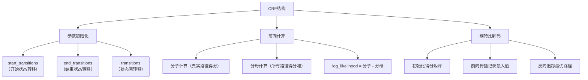

# CRF
下面通过分步骤说明结合可视化流程图解释CRF模型的工作流程：

### 一、核心结构流程图


### 二、关键步骤说明

1. **参数体系**（代码`__init__`部分）
   - 转移矩阵三维参数：
     ```python
     start_transitions = [0.1, -0.5, 0.3]  # 开始状态到各标签的转移概率
     end_transitions = [0.2, -0.1, 0.4]     # 各标签到结束状态的转移概率
     transitions = [
         [0.5, 0.1, -0.3],
         [-0.2, 0.7, 0.4],
         [0.3, -0.1, 0.6]
     ]  # 标签间的转移概率矩阵
     ```

2. **分子计算**（代码`_compute_score`方法）
   - 计算示例：
     ```
     时间步0：start -> 标签0（得分0.1） + 发射得分2.5 = 2.6
     时间步1：标签0 -> 标签2（得分-0.3） + 发射得分1.2 = 1.5
     时间步2：标签2 -> 结束（得分0.4） = 0.4
     总得分 = 2.6 + 1.5 + 0.4 = 4.5
     ```

3. **分母计算**（代码`_compute_normalizer`方法）
   - 动态规划过程可视化：
     ```
     Timestep 0:
     | tag0: start(0.1) + emission0(2.5) = 2.6
     | tag1: start(-0.5) + emission1(1.3) = 0.8
     | tag2: start(0.3) + emission2(0.7) = 1.0

     Timestep 1:
     | tag0: max(tag0+transition0_0, tag1+transition1_0, tag2+transition2_0) + emission0(1.8)
     | => max(2.6+0.5, 0.8-0.2, 1.0+0.3) = 3.1 + 1.8 = 4.9
     ```

4. **维特比解码**（代码`_viterbi_decode`方法）
   - 路径回溯示例：
     ```
     时间步3最大得分索引：标签2
     时间步2前驱索引：标签1
     时间步1前驱索引：标签0
     最终路径：[标签0, 标签1, 标签2]
     ```

### 三、核心代码对照
```python
# 参数初始化
self.start_transitions = nn.Parameter(torch.randn(num_tags))
self.transitions = nn.Parameter(torch.randn(num_tags, num_tags))

# 分子计算（简写版）
score += transitions[prev_tag, curr_tag] * mask[i]
score += emissions[i, curr_tag] * mask[i]

# 分母计算（核心逻辑）
next_score = prev_score + transitions + emissions[i]
score = logsumexp(next_score)

# 维特比解码（核心逻辑）
next_score, indices = (prev_score + transitions + emission).max(dim=1)
history.append(indices)  # 记录前驱索引
```

### 四、流程特点总结
1. **双路径设计**：明确区分真实路径和所有可能路径的得分计算
2. **动态规划优化**：通过并行计算保持时间复杂度为O(n*k²)，k为标签数
3. **数值稳定性**：使用logsumexp处理指数运算的溢出问题
4. **序列有效性**：通过mask矩阵处理变长序列

这一实现完整呈现了CRF模型的三大核心功能：参数学习、概率计算、序列推断，通过与神经网络的结合可以构建强大的序列标注模型。


---


# CRF 整体流程


### 发射分数 emission_score 怎么来的

- 是从CRF的上一层直接传下来的 last_hidden_state, shape = (batch_size, seq_length, hidden_size)


### 转移分数 transition_score 怎么来的：

- 直接初始化
- start_transitions: 开始状态到各标签的转移概率, shape = (num_tags,)
- 作用： 
    - 表示从开始状态到某个标签的概率
    - 初始状态下，模型可以选择任何标签作为起始标签，start_transitions 提供了这些标签的初始概率。
- end_transitions: 各标签到结束状态的转移概率, shape = (num_tags,)
- 作用：
    - 表示从某个标签到结束状态的概率
    - 模型在预测序列的最后一个标签时，end_transitions 提供了这些标签到结束状态的概率。


### 2. **分子计算** (`_compute_score`)  
**目标**：计算给定标签序列的路径总得分  
**核心步骤**：  
① **初始得分**  
   ```python  
   score = start_transitions[tag_0] + emissions[0][tag_0]  
   ```  
   每个样本初始分 = 起始到第一个标签的转移分 + 第一个位置的发射分  

② **序列传播**  
   ```python  
   for i in 1...seq_len-1:  
       score += transitions[tag_{i-1}, tag_i] * mask[i]  # 转移分  
       score += emissions[i][tag_i] * mask[i]             # 发射分  
   ```  
   每个时间步仅对有效位置（mask=1）累加分数  

③ **结束处理**  
   ```python  
   score += end_transitions[last_valid_tag]  
   ```  
   加入最后一个有效标签到结束状态的转移分  

**时间复杂度**：O(n) 线性复杂度（n为序列长度）  

---

### 3. **分母计算** (`_compute_normalizer`)  
**目标**：计算所有可能路径的log-sum-exp得分  
**动态规划实现**：  
① **初始化**  
   ```python  
   score = start_transitions + emissions[0]  # (batch, num_tags)  
   ```  
   每个标签的初始分 = 起始转移分 + 首个发射分  

② **递推计算**  
   ```python  
   for i in 1...seq_len-1:  
       # 三维张量操作 (batch, curr_tag, next_tag)  
       next_score = score + transitions.T + emissions[i]  
       score = logsumexp(next_score, dim=1) * mask[i]  
   ```  
   关键公式：  
   $$\alpha_t(j) = \log \sum_{i} \exp(\alpha_{t-1}(i) + T_{i,j} + E_t(j))$$  

③ **终止处理**  
   ```python  
   score += end_transitions  
   final_score = logsumexp(score, dim=1)  
   ```  
   最终对所有标签求和得到归一化因子  

**时间复杂度**：O(nk²) （k为标签数，n为序列长度）  

---

### 4. **关键对比表**

| 特征                | 分子计算                  | 分母计算                  |
|--------------------|-------------------------|-------------------------|
| **输入依赖**        | 真实标签序列             | 仅发射分数              |
| **计算目标**        | 单一路径得分             | 所有路径概率和           |
| **核心操作**        | 标量累加                | 矩阵logsumexp           |
| **内存消耗**        | O(1)                   | O(batch×num_tags)       |
| **是否可并行**      | 完全并行                | 需维护动态规划矩阵       |

---


#### 6. **输出应用**
```python  
log_likelihood = numerator - denominator  # 对数似然  
loss = -log_likelihood.mean()             # 标准CRF损失  
```

这种设计使CRF可无缝集成到神经网络中，通过反向传播**自动学习转移矩阵参数**。


# 维特比算法 【Viterbi】
维特比算法(Viterbi Algorithm)是一种动态规划算法，用于在CRF中找到最可能的标签序列。以下是该算法在CRF中的具体流程：

初始化阶段：

```python
# 计算第一个时间步的分数 = 开始转移分数 + 第一个发射分数
score = self.start_transitions + emissions[0]
```

递推阶段（遍历序列的每个时间步）：

```python
for i in range(1, seq_length):
    # 广播当前分数和发射分数
    broadcast_score = score.unsqueeze(2)  # (batch, num_tags, 1)   # 当前各路线成本 
    broadcast_emission = emissions[i].unsqueeze(1)  # (batch, 1, num_tags)   # 下一站处理费  
    
    # 计算所有可能的转移路径分数 = 当前成本 + 转运费 + 下一站处理费   
    next_score = broadcast_score + self.transitions + broadcast_emission
    
    # 选择最优路径（最大分数）并记录历史索引
    next_score, indices = next_score.max(dim=1)  # 选择最优前驱路线    # 找出最低成本（效益最大）的上一站   # 这个操作会找出对于每个样本和每个可能的下一标签，从哪个当前标签转移过来的分数最高
    # indices.shape = (batch_size, num_tags)    # 保存了达到最高分数时对应的前一个标签的索引 [最优前驱索引]
    # next_score.shape = (batch_size, num_tags)  # 保存了每个样本每个标签的最高分数 

    score = torch.where(mask[i].unsqueeze(1), next_score, score)
    history.append(indices)
```

结束阶段：

```python
# 加上结束转移分数
score += self.end_transitions
```

回溯阶段（从最后一个时间步回溯最优路径）：

```python

# 找到最后一个时间步的最高分标签
_, best_last_tag = score[idx].max(dim=0)

# 根据历史记录回溯整个路径
for hist in reversed(history[:seq_ends[idx]]):
    best_last_tag = hist[idx][best_tags[-1]]
    best_tags.append(best_last_tag.item())

# Reverse the order because we start from the last timestep
best_tags.reverse()
best_tags_list.append(best_tags)
```

算法特点：

时间复杂度O(T×N²)，其中T是序列长度，N是标签数量
空间复杂度O(T×N)，需要存储历史索引
保证找到全局最优解（分数最高的标签序列）
利用了动态规划的"最优子结构"特性
该算法通过：

前向传递计算每个时间步的最优分数
反向追踪重建最优路径 最终输出每个序列的最可能标签序列。


以下用快递运输路线选择的类比，将维特比解码过程拆解为步骤明确的流程图：

```markdown
| 步骤 | 代码段 | 通俗解释 | 数学意义 | 快递场景比喻 |
|------|--------|----------|----------|--------------|
| **1. 初始化起运成本** | `score = start_transitions + emissions[0]` | 计算从起点到第一个站点的综合成本 | $S_1(j) = a_{0j} + b_j(o_1)$ | 比较不同快递公司从总部到第一个分拣中心的运费（基础费+首站处理费） |
| **2. 动态规划递推** | `for i in range(1, seq_length):` 内的整个循环 | 逐站计算到当前节点的最优路径 | $S_t(j) = \max_i [S_{t-1}(i) + a_{ij}] + b_j(o_t)$ | 每个分拣中心记录到达本站的最低成本路线 |
| 2.1 扩展计算维度 | `broadcast_score.unsqueeze(2)`<br>`broadcast_emission.unsqueeze(1)` | 将成本数据转换为可矩阵运算的形态 | 张量广播机制 | 把运费表铺开成三维立体价目表 |
| 2.2 计算总成本 | `next_score = broadcast_score + transitions + broadcast_emission` | 综合历史成本+转移成本+当前处理成本 | 状态转移方程计算 | 计算从所有前一站点经不同路线到当前站点的总运费 |
| 2.3 筛选最优路径 | `next_score.max(dim=1)` | 保留到当前节点的最低成本路径 | $\max$ 操作符实现动态规划 | 在每个分拣中心只记录最便宜的来源路线 |
| 2.4 掩码更新状态 | `torch.where(mask[...], next_score, score)` | 处理变长序列（如短句子补全） | 掩码矩阵过滤无效位置 | 跳过未启用的分拣中心（比如未开放的分站） |
| **3. 终点处理** | `score += end_transitions` | 添加终点站的特殊处理成本 | $S_T(j) += a_{j0}$ | 添加最后一站到收货点的特殊手续费 |
| **4. 路径回溯** | `for hist in reversed(history...)` 循环 | 从终点逆向追踪完整路径 | 反向链式求导思想 | 根据各站的物流记录单逆向查找完整运输路线 |
| 4.1 确定终点 | `score[idx].max(dim=0)` | 选择最终成本最低的终点 | $\arg\max$ 操作 | 找出总运费最低的最终收货点 |
| 4.2 逆向追溯 | `best_last_tag = hist[idx][best_tags[-1]]` | 递归查询路径来源 | 回溯矩阵查询 | 根据分拣记录单查询："这个包裹是从哪个上一站来的？" |
```

### 关键数据结构说明（类比快递公司系统）
```markdown
| 数据结构          | 形状              | 作用                            | 快递场景对应物                  |
|--------------------|-------------------|---------------------------------|---------------------------------|
| emissions          | (seq_len, batch, tags) | 各位置产生不同标签的可能性       | 各分拣中心处理不同快递类型的成本表 |
| transitions        | (num_tags, num_tags)  | 标签间的转移概率                | 不同分拣中心之间的运输价格表     |
| history            | List[(batch, tags)]   | 记录每个位置最优路径的前驱节点  | 各分拣中心的物流流向记录单       |
| mask               | (seq_len, batch)      | 标识有效序列长度                | 分拣中心运营状态指示牌           |
```

### 算法复杂度优化技巧
```markdown
| 代码技巧           | 优化效果           | 数学原理                | 快递场景类比                    |
|--------------------|--------------------|-------------------------|---------------------------------|
| 张量广播机制       | 避免显式循环       | 矩阵并行计算            | 同时计算所有可能的运输路线报价  |
| 只保留最大值       | 空间复杂度从O(N^2)降为O(N) | 动态规划状态压缩 | 每个分拣中心只保留最低成本路线  |
| 逆向追溯历史记录   | 时间复杂度保持O(T) | 空间换时间              | 通过记录单快速回溯无需重新计算  |
```


## 维特比算法的可视化原理


# Beam Search

---

### **1. 什么是 Beam Search？**
Beam Search 是一种启发式搜索算法，用于在每一步保留多个候选序列（称为“束”或“beam”），而不是只保留一个最优解。这样可以避免贪心搜索的局部最优问题，同时比穷举搜索更高效。

在 NER（命名实体识别）任务中，Beam Search 用于从所有可能的标签序列中找到得分最高的前 `k` 个序列。

---

### **2. 代码的输入和输出**
- **输入**：
  - `emissions`：发射分数（每个位置对每个标签的得分）。
  - `mask`：标记哪些位置是有效的（避免填充部分影响结果）。
  - `beam_size`：每一步保留的候选序列数量（`k`）。
- **输出**：
  - 每个样本的前 `k` 个最可能的标签序列。

---

### **3. 逐步解释代码**

#### **(1) 初始化**
- **初始候选序列**：
  - 对于每个样本（`batch_size`），生成所有可能的第一个标签的序列。
  - 每个序列的初始得分 = `起始转移分数` + `第一个位置的发射分数`。
  - 例如，如果有 5 个标签，每个样本会生成 5 个候选序列。

#### **(2) 选择 Top-K 序列**
- 对每个样本的候选序列按得分排序，保留前 `beam_size` 个（即 `k` 个）。

#### **(3) 逐步扩展序列**
- 对于序列的每个位置（从第二个位置开始）：
  - **跳过无效位置**：如果 `mask` 标记为无效（如填充部分），直接保留当前候选序列。
  - **扩展候选序列**：
    - 对每个候选序列，尝试添加所有可能的标签。
    - 新得分 = 原得分 + `转移分数`（从前一个标签到当前标签） + `当前发射分数`。
    - 生成新的候选序列（数量 = `beam_size * num_tags`）。
  - **再次选择 Top-K**：
    - 对扩展后的候选序列按得分排序，保留前 `k` 个。

#### **(4) 结束处理**
- 在序列的最后位置，加上 `结束转移分数`（从最后一个标签到结束状态的得分）。
- 对每个样本的所有候选序列按最终得分排序，返回前 `k` 个。

---

### **4. 关键点总结**
1. **动态扩展**：每一步只保留 `k` 个候选序列，避免穷举所有可能的标签序列。
2. **分数组成**：
   - 起始转移分数：从开始状态到第一个标签的得分。
   - 转移分数：标签之间的转移得分（如 `B-PER` 到 `I-PER`）。
   - 发射分数：模型对当前位置标签的预测得分。
   - 结束转移分数：从最后一个标签到结束状态的得分。
3. **掩码处理**：跳过填充部分，避免无效计算。

---

### **5. 通俗类比**
想象你在玩一个迷宫游戏：
- 每一步你可以选择多条路径（标签），但只记录得分最高的 `k` 条。
- 每次选择路径时，会考虑：
  - 上一步的得分（历史路径得分）。
  - 当前路径的难度（转移分数）。
  - 当前路径的奖励（发射分数）。
- 最终，你会从所有尝试过的路径中选出 `k` 条最优的。

---

### **6. 为什么用 Beam Search？**
- **贪心搜索**：每一步选最优标签，可能错过全局最优。
- **穷举搜索**：计算所有可能的标签序列，计算量太大。
- **Beam Search**：平衡两者，高效且效果好。

---

