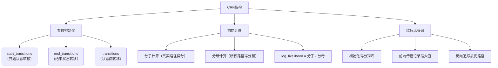

# CRF
下面通过分步骤说明结合可视化流程图解释CRF模型的工作流程：

### 一、核心结构流程图


### 二、关键步骤说明

1. **参数体系**（代码`__init__`部分）
   - 转移矩阵三维参数：
     ```python
     start_transitions = [0.1, -0.5, 0.3]  # 开始状态到各标签的转移概率
     end_transitions = [0.2, -0.1, 0.4]     # 各标签到结束状态的转移概率
     transitions = [
         [0.5, 0.1, -0.3],
         [-0.2, 0.7, 0.4],
         [0.3, -0.1, 0.6]
     ]  # 标签间的转移概率矩阵
     ```

2. **分子计算**（代码`_compute_score`方法）
   - 计算示例：
     ```
     时间步0：start -> 标签0（得分0.1） + 发射得分2.5 = 2.6
     时间步1：标签0 -> 标签2（得分-0.3） + 发射得分1.2 = 1.5
     时间步2：标签2 -> 结束（得分0.4） = 0.4
     总得分 = 2.6 + 1.5 + 0.4 = 4.5
     ```

3. **分母计算**（代码`_compute_normalizer`方法）
   - 动态规划过程可视化：
     ```
     Timestep 0:
     | tag0: start(0.1) + emission0(2.5) = 2.6
     | tag1: start(-0.5) + emission1(1.3) = 0.8
     | tag2: start(0.3) + emission2(0.7) = 1.0

     Timestep 1:
     | tag0: max(tag0+transition0_0, tag1+transition1_0, tag2+transition2_0) + emission0(1.8)
     | => max(2.6+0.5, 0.8-0.2, 1.0+0.3) = 3.1 + 1.8 = 4.9
     ```

4. **维特比解码**（代码`_viterbi_decode`方法）
   - 路径回溯示例：
     ```
     时间步3最大得分索引：标签2
     时间步2前驱索引：标签1
     时间步1前驱索引：标签0
     最终路径：[标签0, 标签1, 标签2]
     ```

### 三、核心代码对照
```python
# 参数初始化
self.start_transitions = nn.Parameter(torch.randn(num_tags))
self.transitions = nn.Parameter(torch.randn(num_tags, num_tags))

# 分子计算（简写版）
score += transitions[prev_tag, curr_tag] * mask[i]
score += emissions[i, curr_tag] * mask[i]

# 分母计算（核心逻辑）
next_score = prev_score + transitions + emissions[i]
score = logsumexp(next_score)

# 维特比解码（核心逻辑）
next_score, indices = (prev_score + transitions + emission).max(dim=1)
history.append(indices)  # 记录前驱索引
```

### 四、流程特点总结
1. **双路径设计**：明确区分真实路径和所有可能路径的得分计算
2. **动态规划优化**：通过并行计算保持时间复杂度为O(n*k²)，k为标签数
3. **数值稳定性**：使用logsumexp处理指数运算的溢出问题
4. **序列有效性**：通过mask矩阵处理变长序列

这一实现完整呈现了CRF模型的三大核心功能：参数学习、概率计算、序列推断，通过与神经网络的结合可以构建强大的序列标注模型。


---


# CRF 整体流程


### 发射分数 emission_score 怎么来的

- 是从CRF的上一层直接传下来的 last_hidden_state, shape = (batch_size, seq_length, hidden_size)


### 转移分数 transition_score 怎么来的：

- 直接初始化
- start_transitions: 开始状态到各标签的转移概率, shape = (num_tags,)
- 作用： 
    - 表示从开始状态到某个标签的概率
    - 初始状态下，模型可以选择任何标签作为起始标签，start_transitions 提供了这些标签的初始概率。
- end_transitions: 各标签到结束状态的转移概率, shape = (num_tags,)
- 作用：
    - 表示从某个标签到结束状态的概率
    - 模型在预测序列的最后一个标签时，end_transitions 提供了这些标签到结束状态的概率。


### 2. **分子计算** (`_compute_score`)  
**目标**：计算给定标签序列的路径总得分  
**核心步骤**：  
① **初始得分**  
   ```python  
   score = start_transitions[tag_0] + emissions[0][tag_0]  
   ```  
   每个样本初始分 = 起始到第一个标签的转移分 + 第一个位置的发射分  

② **序列传播**  
   ```python  
   for i in 1...seq_len-1:  
       score += transitions[tag_{i-1}, tag_i] * mask[i]  # 转移分  
       score += emissions[i][tag_i] * mask[i]             # 发射分  
   ```  
   每个时间步仅对有效位置（mask=1）累加分数  

③ **结束处理**  
   ```python  
   score += end_transitions[last_valid_tag]  
   ```  
   加入最后一个有效标签到结束状态的转移分  

**时间复杂度**：O(n) 线性复杂度（n为序列长度）  

---

### 3. **分母计算** (`_compute_normalizer`)  
**目标**：计算所有可能路径的log-sum-exp得分  
**动态规划实现**：  
① **初始化**  
   ```python  
   score = start_transitions + emissions[0]  # (batch, num_tags)  
   ```  
   每个标签的初始分 = 起始转移分 + 首个发射分  

② **递推计算**  
   ```python  
   for i in 1...seq_len-1:  
       # 三维张量操作 (batch, curr_tag, next_tag)  
       next_score = score + transitions.T + emissions[i]  
       score = logsumexp(next_score, dim=1) * mask[i]  
   ```  
   关键公式：  
   $$\alpha_t(j) = \log \sum_{i} \exp(\alpha_{t-1}(i) + T_{i,j} + E_t(j))$$  

③ **终止处理**  
   ```python  
   score += end_transitions  
   final_score = logsumexp(score, dim=1)  
   ```  
   最终对所有标签求和得到归一化因子  

**时间复杂度**：O(nk²) （k为标签数，n为序列长度）  

---

### 4. **关键对比表**

| 特征                | 分子计算                  | 分母计算                  |
|--------------------|-------------------------|-------------------------|
| **输入依赖**        | 真实标签序列             | 仅发射分数              |
| **计算目标**        | 单一路径得分             | 所有路径概率和           |
| **核心操作**        | 标量累加                | 矩阵logsumexp           |
| **内存消耗**        | O(1)                   | O(batch×num_tags)       |
| **是否可并行**      | 完全并行                | 需维护动态规划矩阵       |

---


#### 6. **输出应用**
```python  
log_likelihood = numerator - denominator  # 对数似然  
loss = -log_likelihood.mean()             # 标准CRF损失  
```

这种设计使CRF可无缝集成到神经网络中，通过反向传播**自动学习转移矩阵参数**。


# 维特比算法 【Viterbi】
维特比算法(Viterbi Algorithm)是一种动态规划算法，用于在CRF中找到最可能的标签序列。以下是该算法在CRF中的具体流程：

初始化阶段：

python
Apply
# 计算第一个时间步的分数 = 开始转移分数 + 第一个发射分数
score = self.start_transitions + emissions[0]
递推阶段（遍历序列的每个时间步）：

python
Apply
for i in range(1, seq_length):
    # 广播当前分数和发射分数
    broadcast_score = score.unsqueeze(2)  # (batch, num_tags, 1)
    broadcast_emission = emissions[i].unsqueeze(1)  # (batch, 1, num_tags)
    
    # 计算所有可能的转移路径分数
    next_score = broadcast_score + self.transitions + broadcast_emission
    
    # 选择最优路径（最大分数）并记录历史索引
    next_score, indices = next_score.max(dim=1)
    score = torch.where(mask[i].unsqueeze(1), next_score, score)
    history.append(indices)
结束阶段：

python
Apply
# 加上结束转移分数
score += self.end_transitions
回溯阶段（从最后一个时间步回溯最优路径）：

python
Apply
# 找到最后一个时间步的最高分标签
_, best_last_tag = score[idx].max(dim=0)

# 根据历史记录回溯整个路径
for hist in reversed(history[:seq_ends[idx]]):
    best_last_tag = hist[idx][best_tags[-1]]
    best_tags.append(best_last_tag.item())
算法特点：

时间复杂度O(T×N²)，其中T是序列长度，N是标签数量
空间复杂度O(T×N)，需要存储历史索引
保证找到全局最优解（分数最高的标签序列）
利用了动态规划的"最优子结构"特性
该算法通过：

前向传递计算每个时间步的最优分数
反向追踪重建最优路径 最终输出每个序列的最可能标签序列。


# Beam Search
