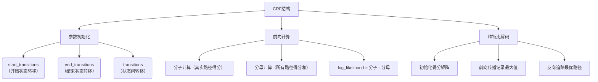

# CRF
下面通过分步骤说明结合可视化流程图解释CRF模型的工作流程：

### 一、核心结构流程图


### 二、关键步骤说明

1. **参数体系**（代码`__init__`部分）
   - 转移矩阵三维参数：
     ```python
     start_transitions = [0.1, -0.5, 0.3]  # 开始状态到各标签的转移概率
     end_transitions = [0.2, -0.1, 0.4]     # 各标签到结束状态的转移概率
     transitions = [
         [0.5, 0.1, -0.3],
         [-0.2, 0.7, 0.4],
         [0.3, -0.1, 0.6]
     ]  # 标签间的转移概率矩阵
     ```

2. **分子计算**（代码`_compute_score`方法）
   - 计算示例：
     ```
     时间步0：start -> 标签0（得分0.1） + 发射得分2.5 = 2.6
     时间步1：标签0 -> 标签2（得分-0.3） + 发射得分1.2 = 1.5
     时间步2：标签2 -> 结束（得分0.4） = 0.4
     总得分 = 2.6 + 1.5 + 0.4 = 4.5
     ```

3. **分母计算**（代码`_compute_normalizer`方法）
   - 动态规划过程可视化：
     ```
     Timestep 0:
     | tag0: start(0.1) + emission0(2.5) = 2.6
     | tag1: start(-0.5) + emission1(1.3) = 0.8
     | tag2: start(0.3) + emission2(0.7) = 1.0

     Timestep 1:
     | tag0: max(tag0+transition0_0, tag1+transition1_0, tag2+transition2_0) + emission0(1.8)
     | => max(2.6+0.5, 0.8-0.2, 1.0+0.3) = 3.1 + 1.8 = 4.9
     ```

4. **维特比解码**（代码`_viterbi_decode`方法）
   - 路径回溯示例：
     ```
     时间步3最大得分索引：标签2
     时间步2前驱索引：标签1
     时间步1前驱索引：标签0
     最终路径：[标签0, 标签1, 标签2]
     ```

### 三、核心代码对照
```python
# 参数初始化
self.start_transitions = nn.Parameter(torch.randn(num_tags))
self.transitions = nn.Parameter(torch.randn(num_tags, num_tags))

# 分子计算（简写版）
score += transitions[prev_tag, curr_tag] * mask[i]
score += emissions[i, curr_tag] * mask[i]

# 分母计算（核心逻辑）
next_score = prev_score + transitions + emissions[i]
score = logsumexp(next_score)

# 维特比解码（核心逻辑）
next_score, indices = (prev_score + transitions + emission).max(dim=1)
history.append(indices)  # 记录前驱索引
```

### 四、流程特点总结
1. **双路径设计**：明确区分真实路径和所有可能路径的得分计算
2. **动态规划优化**：通过并行计算保持时间复杂度为O(n*k²)，k为标签数
3. **数值稳定性**：使用logsumexp处理指数运算的溢出问题
4. **序列有效性**：通过mask矩阵处理变长序列

这一实现完整呈现了CRF模型的三大核心功能：参数学习、概率计算、序列推断，通过与神经网络的结合可以构建强大的序列标注模型。


# 维特比算法 【Viterbi】


# Beam Search
